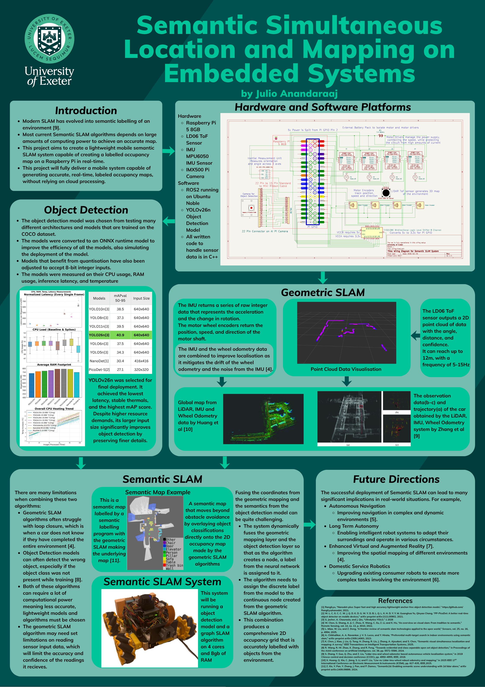

# Semantic Simultaneous Location and Mapping (SLAM)

This repository holds the code for the semantic SLAM algorithm created for a custom made robot that creates a semantic map using a 2D LiDAR and odometry sensors.

## Description

This project is dedicated to building a SLAM algorithm that utilises data from a 2D LiDAR sensor and odometry sensors. The LiDAR provides the outline of it's surroundings within a designated area. This data will be compiled to eventually create a floor plan for an entire room. The odometry sensors will track the movements of the robot within the environment, allowing the robot to localise itself within the environment, and gauge the distance between objects that are detected within a room. This will create the entire SLAM algorithm.

The SLAM algorithm will be complimented by a deep learning model that will classify objects it sees from a live camera feed. The camera module used is able to run a CNN on it, allowing the main system to bear the overhead of running a deep learning model at the same time. The deep learning model is trained on publicly found datasets of household objects, as the main environment this robot will be used in is a household.

## Poster



## Building

This project can be built on any operating system supported by CMake.

Clone the repository and please install the CMake compiler before trying to build this project.

In a different terminal, run the ros2 lidar node so it can be read by the SLAM program:

```ros2 launch ldlidar_stl_ros2 ld06.launch.py```

Afterwards, use the commands to run the main SLAM algorithm:

```cmake --build build```
 then 
```./build/slam```

Also run slam toolbox with the slam.yaml file using the command:
```ros2 launch slam_toolbox online_async_launch.py slam_params_file:=./slam.yaml```

Nav2 can be run using the command:
```ros2 launch nav2_bringup navigation_launch.py use_sim_time:=false params_file:=./slam_nav2.yaml```

Explore_lite can be run using this command:
```ros2 launch explore_lite explore.launch.py use_sim_time:=false```

## Robot Car Parts

* [Raspberry Pi 5 8GB](https://thepihut.com/collections/raspberry-pi)
* [Mecanum MP Robot Chassis Kit](https://www.waveshare.com/robot-chassis.htm)
* [Raspberry Pi AI Camera Module](https://thepihut.com/products/raspberry-pi-ai-camera)
* [Uninterruptible Power Supply UPS HAT (B) for Raspberry Pi](https://thepihut.com/products/uninterruptible-power-supply-ups-hat-b-for-raspberry-pi)
* [4 DRV8871 Motor Drivers](https://thepihut.com/products/adafruit-drv8871-dc-motor-driver-breakout-board-3-6a-max)
* [4 TT Motors with Encoders Attached](https://thepihut.com/products/tt-motor-with-encoder-6v-160rpm-120-1)
* [7.2 Ni-MH Battery Pack](https://thepihut.com/products/tt-motor-with-encoder-6v-160rpm-120-1)
* [OKDO Lidar Hat for the Raspberry PI](https://uk.rs-online.com/web/p/sensor-development-tools/2037609)
* [8-Channel Logic Level Converter Bi-directional Converter](https://www.amazon.co.uk/DollaTek-Channel-Bi-directional-Converter-TXS0108E/dp/B07DK6QGHG?crid=S5TQWTC5NRIN&dib=eyJ2IjoiMSJ9.1CE4b0dkFsEPCG2fmbxsUV8_m9kvFHZ5gD6jM0pFrV5qNLAENTCtQ8vgsc7HGDXzTc3WsrcizZEJ2vcWHEQKohpznySr4jaaKHV80H_TTY9F8ZgUkRRlZ9Uz-OjQ9XGy8Cjb-kbQHLenoSmB3KJMAIcUmWcAnKlI58B9H4322B5GvYJb0oRu4eWIucBxW8gXAEyKg5aQPMso1TLn4OZwJWTPKSCTPvySD6FfVj5o-Fv7_-9o98VOXpP_1YwPkTxobT9xmko-OS2EeFIDa4bhjfqOveusZGTovivWeCHvhmM.Iu3RCIus-Y62_KzBzLlUzOrwToNR0qncwUowhD6-Kws&dib_tag=se&keywords=dollatek+logic+level+converter&qid=1772892667&sprefix=dollatek+logic+level+convert%2Caps%2C228&sr=8-1)
* [Dollatek MPU-6050 Inertial Measurement Unit](https://www.amazon.co.uk/DollaTek-MPU-6050-mpu6050-Accelerometer-Arduino/dp/B07DJ4KMBF?crid=3IIHAC5K5TAJS&dib=eyJ2IjoiMSJ9.AD3UVa4HQO0WjS3ZhZH_5k4BSWfYpejUI-FgRuhNWr5ZZYuMRVjefJFODQQ23Qyk0lrRnF77RN9C1iCO22gYrVAuU--vQlnVv872_gkfVWpl5M5z52UbrUsPQOG13m2tW5PgYqnn8qm3yqYAhSOOdY1hMZkP7v84VPnl4jxDRLRNtFXUJX_WUEvP0iwhY3tuZOLNpN0CDcROyBUfSuxOwSzUATrlRx3JsZSUPH_ukyJ6iuM2fm6-PTseKhHJx37ZIprvYOkwvdDdKtJPFiF180SF6JSB0sHp9tRG4-BEthE.GqEzbJoANyYypNNDUlEHJUZ4_wOJBVIcOHcThXbJhk0&dib_tag=se&keywords=dollatek+mpu-6050&qid=1773937329&sprefix=dollatek+mpu-6050%2Caps%2C266&sr=8-1)

## Wiring Diagram


## License

This project is licensed under the MiT License - see the LICENSE.md file for details.


