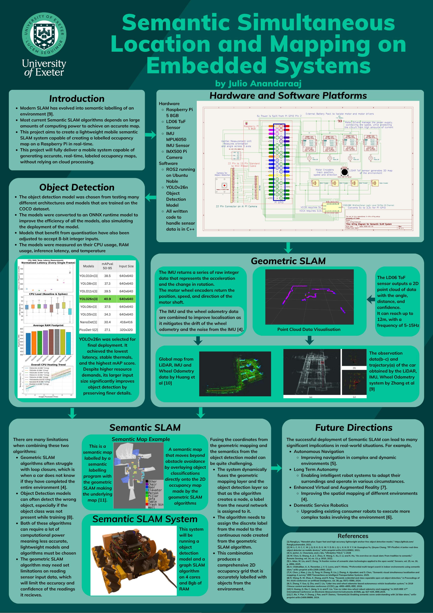

# Semantic Simultaneous Location and Mapping (SLAM)

This repository holds the code for the semantic SLAM algorithm created for a custom made robot that creates a semantic map using a 2D LiDAR and odometry sensors.

## Description

This project is dedicated to building a SLAM algorithm that utilises data from a 2D LiDAR sensor and odometry sensors. The LiDAR provides the outline of it's surroundings within a designated area. This data will be compiled to eventually create a floor plan for an entire room. The odometry sensors will track the movements of the robot within the environment, allowing the robot to localise itself within the environment, and gauge the distance between objects that are detected within a room. This will create the entire SLAM algorithm.

The SLAM algorithm will be complimented by a deep learning model that will classify objects it sees from a live camera feed. The camera module used is able to run a CNN on it, allowing the main system to bear the overhead of running a deep learning model at the same time. The deep learning model is trained on publicly found datasets of household objects, as the main environment this robot will be used in is a household.

## Poster



## Building

This project can be built on any operating system supported by CMake.

Clone the repository and please install the CMake compiler before trying to build this project.

Use the commands to build the main SLAM algorithm:

```cmake --build build```
 then 
```./build/slam```

The entire Semantic SLAM pipeline can be started using
```stdbuf -oL -eL ros2 launch launch.py 2>&1 | tee ~/pi/SemanticSLAM/master_session.log```
to see all the logs associated for each output from the launch.py.

## Robot Car Parts

* [Raspberry Pi 5 8GB](https://thepihut.com/collections/raspberry-pi)
* [Raspberry Pi Pico](https://thepihut.com/products/raspberry-pi-pico)
* [Mecanum MP Robot Chassis Kit](https://www.waveshare.com/robot-chassis.htm)
* [Raspberry Pi Camera Module 2](https://thepihut.com/products/raspberry-pi-camera-module)
* [Uninterruptible Power Supply UPS HAT (B) for Raspberry Pi](https://thepihut.com/products/uninterruptible-power-supply-ups-hat-b-for-raspberry-pi)
* [4 DRV8871 Motor Drivers](https://thepihut.com/products/adafruit-drv8871-dc-motor-driver-breakout-board-3-6a-max)
* [4 TT Motors with Encoders Attached](https://thepihut.com/products/tt-motor-with-encoder-6v-160rpm-120-1)
* [7.2 Ni-MH Battery Pack](https://thepihut.com/products/tt-motor-with-encoder-6v-160rpm-120-1)
* [OKDO Lidar Hat for the Raspberry PI](https://uk.rs-online.com/web/p/sensor-development-tools/2037609)
* [Dollatek MPU-9250 10-DOF Inertial Measurement Unit](https://www.amazon.co.uk/Lecreatekit-MPU-9250-Accelerometer-Gyroscope-Projects/dp/B0GWQH8Y9W?source=ps-sl-shoppingads-lpcontext&psc=1&smid=A89657MOZG5L6)
* [8-Channel Optocoupler Isolation Board](https://www.amazon.co.uk/Optocoupler-Isolation-12V-24V-8-Channel-Converter/dp/B08LVXK6L2?source=ps-sl-shoppingads-lpcontext&psc=1&smid=A2EOCSXVRJQVRR)

## Wiring Diagram


## Results
The results seen from the semantic pipeline are from an rviz2 instance showing the semantic map created. The results were not as expected as the assumption that the camera was parallel with the ground, due to no depth camera, was severely inhibiting the localisation of the items on the map. The map created and the robot moving where incredibly slow due to running a object detection model and a graph SLAM algorithm on the same CPU.


## License

This project is licensed under the MiT License - see the LICENSE.md file for details.


